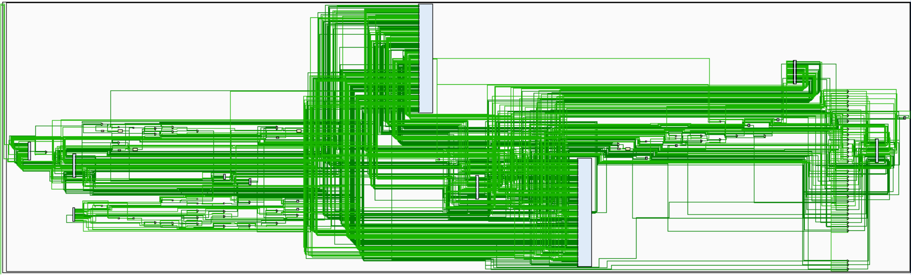

# 5-Stage Pipeline CPU supporting 50 MIPS Instructions

## Control Signals

```verilog
typedef struct packed{
    logic RegDst;
    logic Jump;
    logic Branch;
    logic MemRead;
    logic Mem2Reg;
    logic [3:0] ALUOp;
    logic Imm2UpReg;
    logic JumpReg;
    logic WriteRA;
    logic MemWrite;
    logic ALUSrc;
    logic RegWrite;
    logic ImmSign;
    logic SaImm;
    logic Shift;
    mdu_operation_t MduOp;
    logic MduStart;
    logic [1:0] MemGrain;
    logic MemSign;
    logic InsException;
}Controller;
```

## Operand Forwarding

Besides the forwarding needed by the EX stage, the ID stage also requires oprand forwarding to feed branching and jumping, sending results from the EX stage directly to the ID stage through a verilog wire.

## Blocking

Since branching and jumping are determined in the ID stage, which are previous to most other instructions' calculation in the EX stage, there is even one more stage ahead for the instructions loading from the MEM stage  i.e., the `lw` instruction set. Thus, either a forward from the MEM stage to the ID stage or another blocking is need. I choose to add a blocking.

For blocking brought by MDU, I detect whether MDU is used in the EX stage and AND it with the busy signal. Once the condition is met, I block the previous two stages and clear the EX_MEM register.

## Exception

Solving execptions for non-alaigned memory reading and writing.
The exception handling logic of `LH,LHU,SH` goes below, and I deal with `LW,SW` similarly.

```c++
vAddr <- sign_extend(offset) + GPR[base]
if vAddr[0] != 0 then
    SignalException(AddressError)
endif
```

## Vivado Simulation


